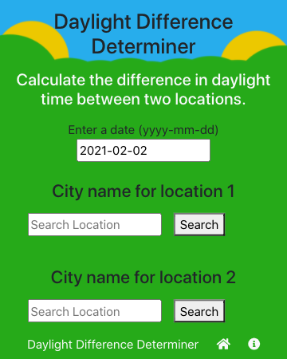

 
# Daylight Difference Determiner

## Calculate the difference in daylight time between two chosen locations.

 I built this app the winter of 2020/21 while hiding from COVID-19, tucked away in a quiet house in the woods near Acadia National Park.
 The super short winter days had me wondering how much sunlight we were missing out on compared to friends and family several hours to the south of us.

[You can view the deployed app here:](https://keiththarp.github.io/daylight-difference/ "View Daylight Difference Determiner App") https://keiththarp.github.io/daylight-difference/

## How to use
1. Select a date or skip to default to today's date.
2. Search for a location.
3. Choose correct location.
4. Repeat 2 & 3.
5. Review results.

## Languages/Technologies
* React
* BootStrap
* TypeScript
* Axios
* Luxon

## APIs
* [OpenCage Geocoding](https://opencagedata.com/api) used to populate the location search and Lat/Long data.
* [Sunrise Sunset API](https://sunrise-sunset.org/api) Provides sunrise/set times, but conveniently enough also provides day length data, eliminating a math step.

## How to contribute
If anyone would like to improve the app by contributing, they're welcome to submit a pull request on [GitHub](https://github.com/keiththarp/daylight-difference).

## Developed by
- [Keith Tharp](https://github.com/keiththarp)

Please reach out with questions at:
  - keithstharp@gmail.com

Find more of Keith Tharp's work at:
  - https://github.com/keiththarp

## Acknowledgments and Credits
Thank you to all my fellow students and study groups that helped and supported with this homework project!
Special thanks to [Bobby](https://github.com/rhoffman103) for the Cats App launch pad!

## Licensed under MIT
[Click here for more information on the MIT license.](https://choosealicense.com/licenses/mit/)

        